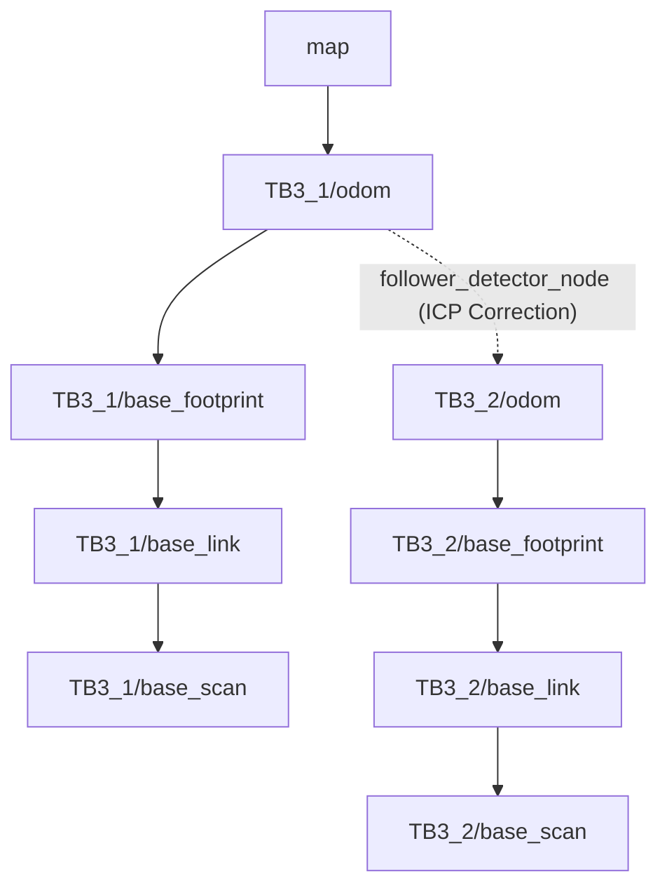

# System Architecture & TF Tree

This document provides an in-depth look at the architecture of the **escort_turtlebot_pkg** project and how multiple robots coordinate in real-time.

## Hybrid Follower Architecture

Traditional multi-robot following systems usually rely on either:
1. Strict Odometry tracking (prone to cumulative drift errors).
2. Pure Vision/LiDAR following without a global map (cannot use global path planning).

The **escort_turtlebot_pkg** employs a **Hybrid Architecture**:
- **Leader (TB3_1)** generates the global map and navigates using full SLAM (`slam_toolbox`) or predefined maps.
- **Follower (TB3_2)** does *not* run a heavy SLAM node. Instead, it relies on the leader's map and uses its own LiDAR purely for the **Local Costmap** (Dynamic Obstacle Avoidance).
- The `follower_detector_node` acts as the bridge. It matches the shape of the physical surroundings seen by both robots' LiDARs (using **ICP Scan Matching**) to synchronize their Odometry (`odom`) frames.

### Automatic Recovery Behavior
If the follower loses sight of the leader or the TF drops (due to occlusion or network lag), the follower immediately enters a standard **Recovery Mode**:
- The active tracking goal is canceled.
- The follower sends a new static goal to the **last known position** of the leader and waits there.
- Once the TF/network is restored and the leader is detected again, the follower smoothly resumes tracking from that spot.

## The TF Tree Structure

In ROS 2 Navigation, Transforms (TF) are critical. Our multi-robot system unifies two separate robots under a single `map` frame using dynamic ICP correction.

### Key Components

1. **`map`**: The global frame created by the Leader's SLAM module.
2. **`TB3_1/odom`**: The dead-reckoning starting point of the Leader.
3. **`TB3_1/odom` -> `TB3_2/odom`**: This transform is dynamically published at 10Hz by the `follower_detector_node`. It calculates the offset between the two robots by aligning `TB3_1/scan` with `TB3_2/scan`. This automatically corrects any drift in the follower's wheels.

## Action Flow for Follower Nodes

1. **Leader Control**: Operator sends `cmd_vel` to `/TB3_1/cmd_vel`. 
2. **Scan Matching**: `follower_detector_node` receives both robots' scans, runs ICP, and updates the `TB3_2/odom` TF.
3. **Target Pose Generation**: `Follower` class (in `escort_follower` package) reads the real-time TF. It looks at the leader's heading, computes a target spot exactly `0.5m` behind the leader, and sends a `FollowPath` Action to `TB3_2/follow_path`.
4. **Local Planning**: The Nav2 stack on TB3_2 computes the motor velocities to reach that spot while dodging local obstacles (people, boxes) that appear on its own LiDAR.
